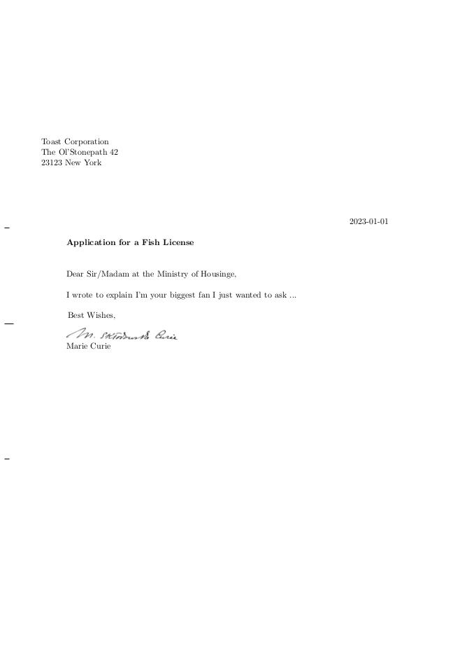

# lettermaker

Write a letter with a minimal TOML file (save as `your_letter.toml`).

```toml

[meta]
template = 'standard'

[fields]
date = '2023-01-01'
address = '''
Toast Corporation\\
The Ol'Stonepath 42\\
23123 New York
'''
subject = 'Application for a Fish License'
opening = 'Dear Sir/Madam at the Ministry of Housinge,'
content = '''
I wrote to explain
I'm your biggest fan
I just wanted to ask ...
'''
closing = 'Best Wishes,'
name = 'Marie Curie'
signaturepath = '../example/signature.png'
```

Run the command

`lettermaker -t your_letter.toml -o my_letter.pdf`

and receive a formatted letter as PDF (as `my_letter.pdf`).



## dependencies

Uses `pdflatex` and `python3`.

## to-dos.

 - [ ] implement prefills (with option `-p, --prefill`) to prefill empty fields with defaults before the default files.
   - [ ] provide prefill for french_formal
   - [ ] provide prefill for french_informal
   - [ ] provide prefill for english_formal
   - [ ] provide prefill for english_informal
   - [ ] provide prefill for german_formal
   - [ ] provide prefill for german_informal
   - [ ] provide prefill for chinese_formal
   - [ ] provide prefill for chinese_informal
 - [ ] look for prefills at ~/.config/lettermaker/prefills/ then at $PROJECT_ROOT/prefills
 - [ ] for empty signature do not include image.
 - [ ] look for defaults at ~/.config/lettermaker/defaults/ then at $PROJECT_ROOT/defaults
 - [ ] implement list function (with option `-l, --list`) to show all prefill and default options.
 - [ ] implement setup function (with option `-s, --setup`) for ~/.config/lettermaker/prefills/
 - [ ] implement setup function (with option `-s, --setup`) for ~/.config/lettermaker/templates/
 - [ ] allow TOML arrays and create a PDF output letter for each permutation.
 - [ ] have flag to toggle visibility of page numbers (define in meta section of toml file).
 - [ ] have flag to toggle visibility of folding guide lines at left margin (define in meta section of toml file).
 - [ ] provide a functionality that does not insert a signature, but instead draws a box where can be signed by hand.

### done 

 - [X] allow to store letter data in TOML file.
 - [X] ie. use this python package: https://docs.python.org/3/library/tomllib.html

## good reads

 - https://www.uweziegenhagen.de/wp-content/uploads/2019/04/Ziegenhagen_scrlttr2Vorlagen.pdf
 - https://www.dickimaw-books.com/latex/admin/html/scrlttr2.shtml

